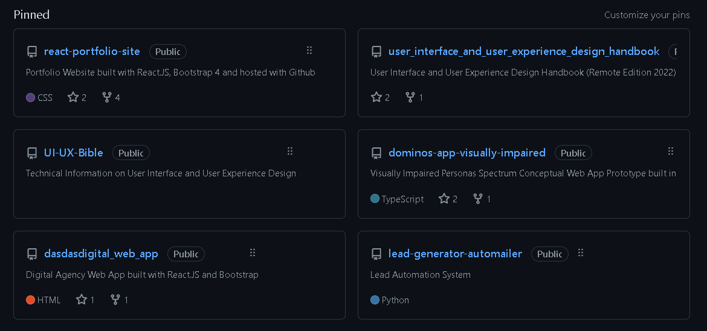
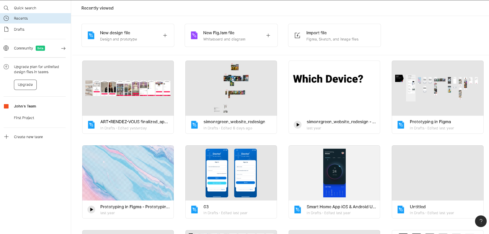
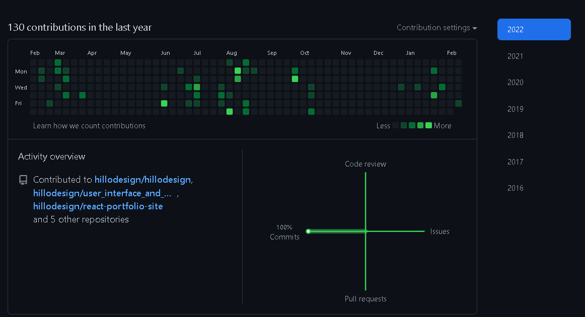

# UX Guru Sass

UX Guru is an online learning platform for designers looking to get started into the UX and UI fields.

A low pressure environment where designers can track their progress as UX Designers.

Some important aspects of this platform is having for example a wildcard ssl that allows for designers to host their own portfolio websites from a subdomain.

for example

uxguru.com/user101

Another aspect of the Sass product is a plugin that can be used with Adobe XD or for example UX design software such as Figma.

    main.js

is an example of sample plugin scaffolding for Adobe XD

This plugin will track for example version history of certain files.

Similarly like Github there are several features that are important to this Sass product concept.

Repos or projects will be the various different design projects that the designer is working on. 

In the Figma plugin it can be the design file for example

Then based on the version history every edit can be seen as contributions which can be detailed year by year, as so a complete look at the total amount of time that a designer has been working on projects can be seen.

An important part of this Sass product is an internal toolkit similar to elementor the WordPress plugin that allows for users to drag and drop elements that will be directly created into working prototypes or production web application.